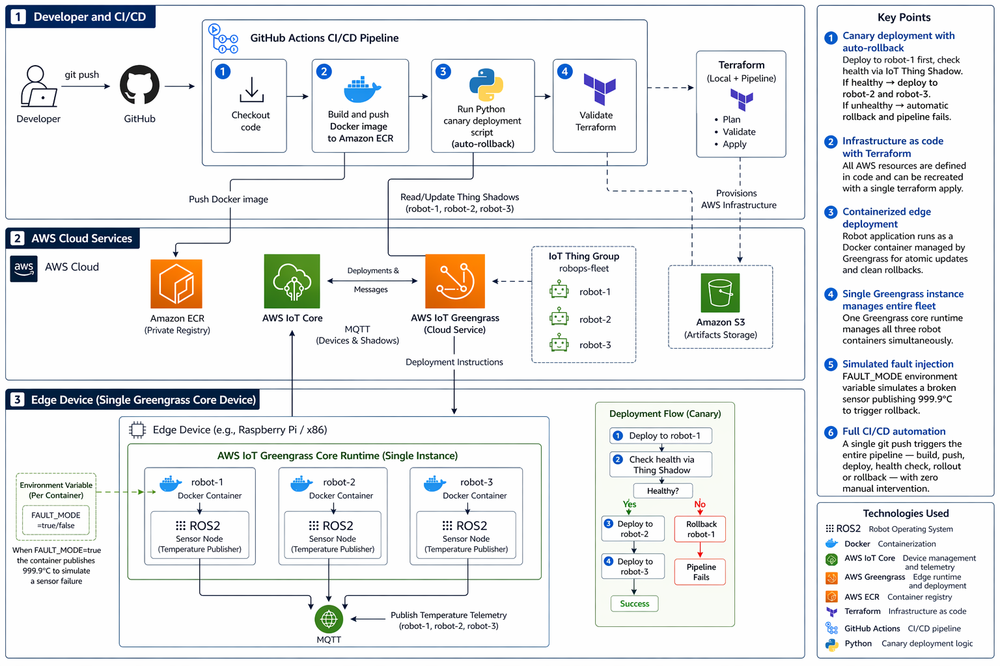

# RobOps — Autonomous CI/CD Pipeline for Edge Robotics

## Overview
RobOps is an end-to-end CI/CD pipeline that automates software deployment to a simulated fleet of edge robots. A code push to GitHub automatically triggers a build, pushes a Docker image to AWS ECR, and deploys it to a robot fleet via AWS Greengrass with canary deployment logic — if sensor telemetry shows an anomaly after the update, the cloud automatically rolls back the firmware.

## Architecture

## Technologies
- ROS2 — Robot Operating System
- Docker — Containerization
- AWS IoT Core — Device management and telemetry
- AWS Greengrass — Edge runtime and deployment
- AWS ECR — Container registry
- Terraform — Infrastructure as code
- GitHub Actions — CI/CD pipeline
- Python — Canary deployment logic

## How it works
1. Developer pushes code to GitHub
2. GitHub Actions builds a new Docker image and pushes it to ECR
3. Canary deploy script deploys to robot-1 first
4. IoT Thing Shadow is read to check sensor health
5. If healthy, deployment rolls out to the full fleet
6. If unhealthy, automatic rollback is triggered and pipeline fails

## Setup
1. Clone the repo
2. Configure AWS credentials
3. Run `terraform apply` to provision infrastructure
4. Start Greengrass: `docker-compose -f docker/greengrass-compose.yml up`
5. Push a change to trigger the pipeline

## Key learnings
- How to manage the software lifecycle of edge hardware
- Canary deployment patterns for hardware fleets
- Infrastructure as code with Terraform
- IoT device management with AWS Greengrass
- End-to-end CI/CD for robotics applications
